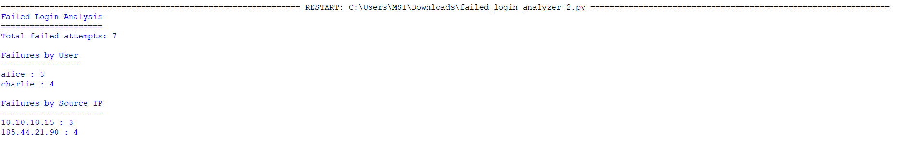
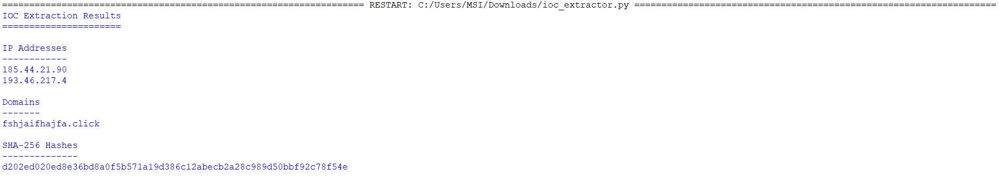
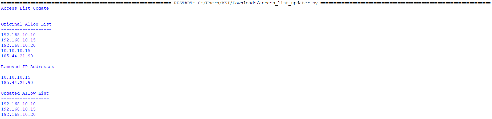

# Module 7 - Automate Cybersecurity Tasks with Python

| Information | Details |
|---|---|
| Course | Automate Cybersecurity Tasks with Python |
| Program | Google Cybersecurity Professional Certificate |
| Focus | Python, Security Automation & Data Processing |
| Status | Completed |

---

## Overview

This module focused on using Python to automate repetitive cybersecurity tasks.

Instead of treating Python only as a programming language, I practiced using it as a practical security tool for:

- analysing authentication activity
- extracting Indicators of Compromise
- updating access-control data
- processing structured security information
- reducing repetitive analyst work

The main goal was to understand how small scripts can support security investigations and operational tasks.

---

# Portfolio Scripts

I created three small Python security scripts:

```text
scripts/
├── failed_login_analyzer.py
├── ioc_extractor.py
└── access_list_updater.py
```

Each script focuses on a different defensive-security use case.

---

# Script 1 - Failed Login Analyzer

[View Script](scripts/failed_login_analyzer.py)

The first script analyses a small authentication dataset and counts failed login attempts by:

```text
Username
+
Source IP
```

The workflow is:

```text
Login attempts
      ↓
Filter failed events
      ↓
Count by user
      ↓
Count by source IP
      ↓
Review repeated failures
```

Example output:

```text
Failed Login Analysis
=====================

Total failed attempts: 7

Failures by User
----------------
alice : 3
charlie : 4

Failures by Source IP
---------------------
10.10.10.15 : 3
185.44.21.90 : 4
```



---

## Security Use Case

A script like this can help reduce a larger authentication dataset into a smaller set of users or IP addresses that may require additional investigation.

Repeated failed logins can be associated with:

- password mistakes
- brute-force attempts
- password spraying
- compromised credentials

The script does not automatically classify repeated failures as malicious.

It identifies activity worth reviewing.

---

# Script 2 - IOC Extractor

[View Script](scripts/ioc_extractor.py)

The second script uses regular expressions to extract common Indicators of Compromise from text.

It identifies:

- IPv4 addresses
- domain names
- SHA-256 hashes

Example input contained:

```text
185.44.21.90
193.46.217.4
fshjaifhajfa.click
d202ed020ed8e36bd8a0f5b571a19d386c12abecb2a28c989d50bbf92c78f54e
```

The script automatically separated the indicators by type.



---

## Security Use Case

During incident response or threat intelligence work, analysts may receive unstructured text containing many technical indicators.

Instead of manually copying each value, a simple parser can help extract:

```text
IPs
Domains
Hashes
```

for further investigation.

This reinforced how Python can support repetitive IOC-handling tasks.

---

# Script 3 - Access List Updater

[View Script](scripts/access_list_updater.py)

The third script simulates updating an IP-based allow list.

The original list contained:

```text
192.168.10.10
192.168.10.15
192.168.10.20
10.10.10.15
185.44.21.90
```

The script removed:

```text
10.10.10.15
185.44.21.90
```

and produced the updated list:

```text
192.168.10.10
192.168.10.15
192.168.10.20
```



---

## Security Use Case

Access lists may need to be updated when:

- a user loses access
- an IP is no longer authorised
- a policy changes
- a system is decommissioned
- suspicious infrastructure is removed from an approved list

Automating simple list updates reduces repetitive manual work and helps make the process more consistent.

---

# Python Concepts Practiced

Across these scripts, I practiced:

- variables
- lists
- dictionaries
- loops
- conditional statements
- string processing
- functions
- regular expressions
- simple data filtering
- counting repeated values
- security-focused automation logic

---

# Security Automation Workflow

A useful automation pattern is:

```text
Input
  ↓
Parse
  ↓
Filter
  ↓
Transform
  ↓
Identify useful security data
  ↓
Output
```

For example:

```text
Authentication events
        ↓
Failed events
        ↓
Count by IP
        ↓
Identify repeated failures
```

or:

```text
Unstructured incident text
        ↓
Regex extraction
        ↓
IPs / domains / hashes
        ↓
Threat intelligence review
```

---

# Why Automation Matters

Security analysts often work with large amounts of repetitive data.

Automation can help with tasks such as:

- parsing logs
- extracting indicators
- filtering authentication events
- processing alerts
- updating access lists
- preparing investigation data
- generating summaries

Python does not replace analyst judgement.

It helps reduce repetitive work so that more time can be spent on investigation and decision-making.

---

# Evidence

```text
evidence/
├── 01-failed-login-analyzer-output.png
├── 02-ioc-extractor-output.png
└── 03-access-list-updater-output.png
```

Each screenshot shows the output of a Python script that I ran locally.

The evidence focuses on working results rather than screenshots of course content.

---

# Related TryHackMe Practice

The automation concepts in this module connect with several hands-on investigations in my TryHackMe portfolio.

### Failed Login Analysis

Related examples:

- [09 - Windows Event Log Analysis](https://github.com/Rhotomir-sc/tryhackme-portfolio-pack/tree/main/portfolio-labs/09-windows-event-log-analysis)
- [10 - Cloud Identity Basics](https://github.com/Rhotomir-sc/tryhackme-portfolio-pack/tree/main/portfolio-labs/10-cloud-identity-basics)

These labs involved repeated authentication failures and source-IP analysis.

The `failed_login_analyzer.py` script demonstrates how a similar task could be automated.

---

### IOC Extraction

Related examples:

- [07 - Incident Response Journal](https://github.com/Rhotomir-sc/tryhackme-portfolio-pack/tree/main/portfolio-labs/07-incident-response-journal)
- [08 - Threat Intelligence & IOC Analysis](https://github.com/Rhotomir-sc/tryhackme-portfolio-pack/tree/main/portfolio-labs/08-threat-intelligence-ioc-analysis)

These labs involved collecting indicators such as:

```text
IP addresses
Domains
URLs
Hashes
File names
```

The `ioc_extractor.py` script demonstrates how part of this collection process can be automated.

---

### Access Control Automation

Related examples:

- [02 - Linux Permissions and Least Privilege](https://github.com/Rhotomir-sc/tryhackme-portfolio-pack/tree/main/portfolio-labs/02-linux-permissions-and-least-privilege)
- [11 - Firewall Rule Audit](https://github.com/Rhotomir-sc/tryhackme-portfolio-pack/tree/main/portfolio-labs/11-firewall-rule-audit)

These labs reinforced the idea that access should be limited to what is required.

The `access_list_updater.py` script applies the same principle to a simple IP allow list.

---

A complete mapping is available here:

[Related TryHackMe Labs](../related-tryhackme-labs.md)

---

# What I Practiced

During this module, I practiced:

- writing basic Python scripts
- using lists and dictionaries
- processing security data
- filtering failed authentication attempts
- counting repeated events
- extracting IOCs with regular expressions
- updating access-control lists
- producing readable script output
- testing scripts locally
- debugging syntax and execution problems
- connecting Python logic with cybersecurity use cases

---

# Key Takeaways

## 1. Small scripts can solve useful security problems

Automation does not need to begin with a large application.

Even a short Python script can reduce repetitive work.

---

## 2. Data must still be interpreted

A script can identify:

```text
4 failed logins
```

but an analyst still needs to decide whether that represents:

```text
User error
Brute force
Password spraying
Another expected condition
```

Automation supports analysis rather than replacing it.

---

## 3. Regular expressions are useful for IOC processing

Security information often appears in unstructured text.

Regex can help extract technical indicators before enrichment or investigation.

---

## 4. Access-control changes can be automated

Python can be used to consistently add, remove, or review access-control entries.

This becomes increasingly useful as datasets grow.

---

## 5. Testing matters

During this module, I also practiced troubleshooting scripts that did not initially run correctly.

Testing the scripts locally and verifying their output was part of the learning process.

---

# Result

This module helped me understand how Python can support practical cybersecurity work.

I created three working scripts for:

```text
Failed-login analysis
IOC extraction
Access-list updating
```

Each script was tested locally and documented with its output.

The most important lesson was that Python automation is most useful when it solves a clear security task and produces results that an analyst can verify.

---

## Next Step

Module 8 focuses on presenting cybersecurity skills, documenting portfolio work, and preparing for security roles.
