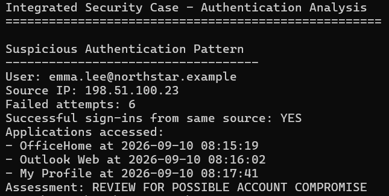

# 07 - Python Automation

## Objective

The goal of this stage is to automate part of the authentication investigation using Python.

The script analyses:

```text
sample-data/signin-events.csv
```

and identifies accounts with repeated failed sign-ins from the same source IP.

It then checks whether successful authentication occurred from that same source.

---

# Script

The Python script is stored in:

```text
scripts/analyze_signin_case.py
```

The script uses:

```text
csv
defaultdict
pathlib
```

to read and analyse the authentication dataset.

---

# Detection Logic

The script follows this workflow:

```text
Read authentication events
        ↓
Group failed attempts by user + source IP
        ↓
Identify 3 or more failed attempts
        ↓
Search for successful sign-ins from same source
        ↓
List applications accessed
        ↓
Generate investigation assessment
```

---

# Suspicious Pattern Detected

The script identified:

```text
User:
emma.lee@northstar.example

Source IP:
198.51.100.23

Failed attempts:
6
```

It also found successful activity from the same source.

Applications accessed:

```text
OfficeHome
Outlook Web
My Profile
```

The script produced the assessment:

```text
REVIEW FOR POSSIBLE ACCOUNT COMPROMISE
```

---

# Evidence

Python execution output:



---

# Why This Matters

Without automation, an analyst may need to manually review individual authentication records.

Python can help reduce repetitive work by:

- counting failed authentication attempts
- grouping events by user and source IP
- finding related successful sign-ins
- highlighting suspicious sequences
- reducing the dataset before analyst review

---

# Analyst Validation

The script does not automatically declare an account compromised.

Instead, it identifies activity that deserves investigation.

This is important because:

```text
Automation detects patterns
        ↓
Analyst validates context
        ↓
Security decision is made
```

A successful sign-in after repeated failures is suspicious, but additional evidence is still required to confirm compromise.

---

# Python Concepts Applied

The script uses:

```text
CSV parsing
Dictionaries
Loops
Conditional statements
Lists
List comprehensions
File paths
Event correlation
```

These concepts are applied directly to a security investigation rather than as isolated programming exercises.

---

# Relationship to Module 7

This case extends the Python automation work from:

```text
07_Module-7_Automate-Cybersecurity-Tasks-with-Python
```

The Module 7 scripts demonstrate smaller security automation tasks.

This integrated case applies the same approach to a multi-stage investigation.

---

# Key Takeaway

Python helps security analysts move from:

```text
Raw authentication events
```

to:

```text
Investigation-focused findings
```

Automation improves speed and consistency, while the final security judgement remains with the analyst.

---

## Next Step

The final stage will combine all findings from the case into a consolidated security assessment and remediation plan.
